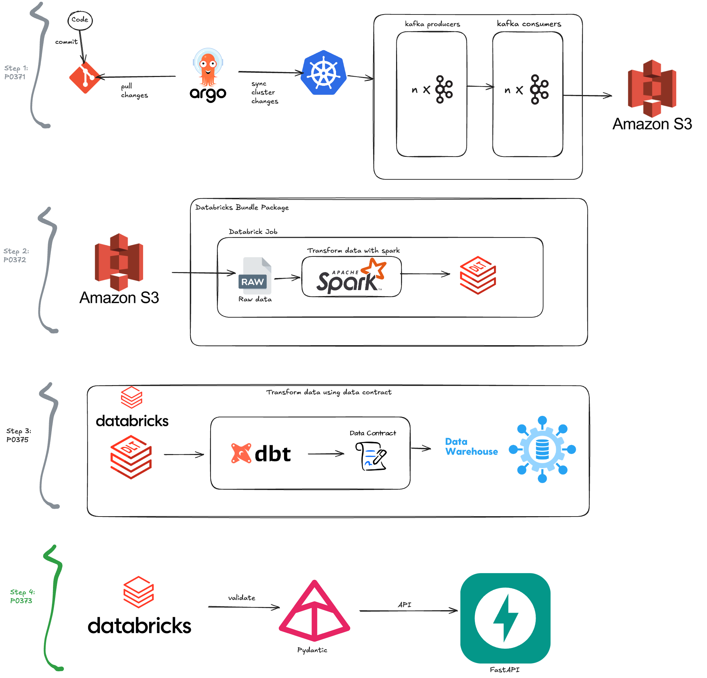

# API with FastAPI

## Project Summary
This project is a REST API built with FastAPI. It is designed to deliver data with robust validation using a specialized library. The API ensures that all data provided meets the required standards and formats, making it reliable and efficient for data delivery tasks.
Validation is implemented using Pydantic, which defines and constrains data to ensure that the output data maintains high quality.

## Project architecture
